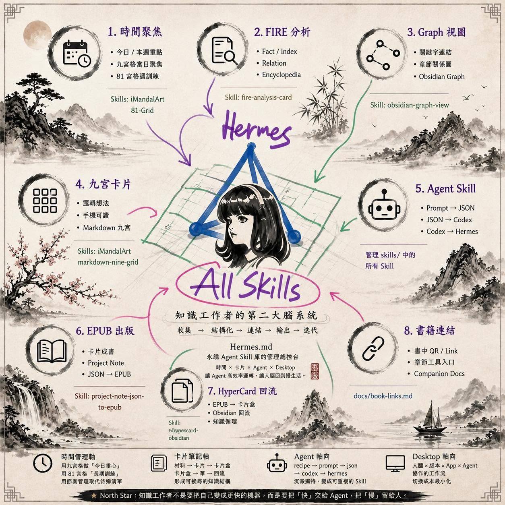

# AI Agent Skills for Chinese Knowledge Workers

> Reusable agent skills for weekly review, iMandalArt, FIRE analysis, card-based notes, writing, publishing, and Chinese knowledge workflows.

iMandalArt, FIRE semantic analysis, planning, and publishing workflows for Claude Code, Codex, and mainstream LLM agents.

[](assets/hermes-all-skills-map.png)

This repository is Yunghsi's public agent-skill system for Chinese knowledge workers. It turns repeatable writing, planning, note-making, and publishing workflows into skills that can be used by Claude Code, Codex, ChatGPT, Gemini, Hermes, and other LLM agents.

The source of truth lives in `skills/*/SKILL.md`; the website turns those files into generated LLM manifests, a searchable skill index, install commands, version labels, Git revisions, and update timestamps.

## What This Repository Is

`twhsi/skills` is an installable, shareable, LLM-readable skill registry. It turns long-running workflows for weekly review, iMandalArt, FIRE analysis, card-based notes, EPUB publishing, HyperCard returns, and desktop work into public procedures that agents can repeat and humans can inspect.

The point is not to make humans behave like faster machines. The point is to let AI spend tokens on repetitive structure, while humans keep judgment, relationships, pace, and the quieter question:

> Which action brings real happiness and peace?

The newest featured skill is [`weekly-reverse-review`](skills/weekly-reverse-review/): it turns annual plans, hundred-year life plans, last week's review, seven days of diary notes, calendar evidence, and inbox noise into the next week's 8 Big Rocks.

Live site: [https://www.twhsi.com/](https://www.twhsi.com/)  
Agent manifest: [https://www.twhsi.com/agent.json](https://www.twhsi.com/agent.json)  
Skill index: [https://www.twhsi.com/skills.json](https://www.twhsi.com/skills.json)  
LLM context: [https://www.twhsi.com/llms.txt](https://www.twhsi.com/llms.txt)

## What It Does

- Convert long Markdown notes into iMandalArt 2.01 hard-line 9-grid cards.
- Apply FIRE semantic analysis for card-box thinking, retrieval, and writing structure.
- Generate agent-readable metadata through `agent.json`, `skills.json`, and `llms.txt`.
- Route daily planning, weekly planning, booklet, EPUB, Markdown, and knowledge-management workflows.
- Package Chinese-first workflows so LLM agents can operate on them consistently.

## Copyable Demo

```text
Input: 200 days of daily plans, manuscript notes, or Markdown drafts
Skills: imandalart + fire-analysis-card + project-note-json-to-epub
Output: FIRE JSON + iMandalArt 2.01 card + Markdown / EPUB / booklet path
```

## Featured: Weekly Reverse Review

[`weekly-reverse-review`](skills/weekly-reverse-review/) turns an 11-step weekly review into an AI-assisted reverse planning loop.

The skill reads four angles before writing the next week:

- `YEAR`: annual plan and hundred-year life plan.
- `Week`: last weekly plan and weekly review.
- `Day`: daily plans, seven-day diary notes, and calendar evidence.
- `Inbox`: loose tasks, reminders, subscriptions, errands, and collected noise.

It then asks what should be smaller, slower, deleted, delayed, or kept as presence instead of achievement. The center question is:

> Which action brings real happiness and peace?

Default answer:

> Speak less. Stay present. Move slowly.

For an LLM or agent, start with:

```bash
curl -s https://www.twhsi.com/llms.txt
```

## Featured: iMandalArt 2.01

[`imandalart`](skills/imandalart/) turns loose source material into one hard-line 3x3 Mandala index card.

iMandalArt 2.01 is designed around a strict text contract:

- Eight orthogonal surrounding angles labeled `Ⓐ` through `Ⓗ`.
- A double center axis displayed as `◎◎◎◎◎`.
- Exactly 11 physical text lines, so the card survives chat previews, note apps, and clipboard workflows.
- Compact CJK-friendly cells for TheBrain/Cerebro, Hermes, Discord, Codex, and other LLM chat surfaces.

Current status: iMandalArt 2.01 is optimized for CJK workflows. An English-native version is planned so the same 3x3 thinking rhythm can work naturally for English notes without forcing a Chinese character contract.

Conceptual example:

```text
ⒶHealth Reset  ⒷManuscript  ⒸMoney Noise
Move with care  Pull one center  Review first
Build rhythm    Draft before all Fund the work

ⒹFamily Spark  ◎◎◎◎◎    ⒺPeople Path
Ask not lecture Weekly Review Keep three cards
Walk the long   ◎◎◎◎◎    Connect next

ⒻInner Release ⒼLearning    ⒽJoyful Rest
Speak less      Number lines  Sing and loosen
Prove nothing   Build index   Guitar and sun
```

Use it for weekly planning, writing focus, knowledge capture, and CJK note workflows where visual stability matters as much as semantic compression.

## What This Is

- A GitHub-backed skill registry for Chinese agent workflows.
- A machine-readable index for LLM agents that need routing, install commands, and resource discovery.
- A human-readable map for deciding which workflows should become reusable skills.
- A static website that publishes each skill's semantic version when declared, latest Git revision, and latest update time.

## Core Skill Stack

| Skill | Role |
|---|---|
| [`imandalart`](skills/imandalart/) | Compress source material into one CJK-friendly 3x3 Mandala card. |
| [`fire-analysis-card`](skills/fire-analysis-card/) | Turn Chinese notes and manuscripts into FIRE semantic analysis cards. |
| [`todays-daily-plan`](skills/todays-daily-plan/) | Convert spoken planning notes into an Obsidian day-plan Mandala grid. |
| [`weekly-reverse-review`](skills/weekly-reverse-review/) | Turn YEAR, Week, Day, and Inbox evidence into one happiness-and-peace-centered weekly plan. |
| [`project-note-json-to-epub`](skills/project-note-json-to-epub/) | Turn structured project-note JSON into EPUB and publishing outputs. |
| [`markdown-nine-grid-clipboard`](skills/markdown-nine-grid-clipboard/) | Convert grids and cards into Markdown table workflows. |

## Current Metadata Highlight

[`fire-analysis-card`](skills/fire-analysis-card/) is now on FIRE 2.0:

- `F = Full-D`: stable numbering for temporary, permanent, and project notes.
- `I = Index`: keyword webs and retrieval handles.
- `R = Route`: thinking paths through the material.
- `E = Evolution`: time-based card-box growth for semantic search.

## Skill Versions And Updates

The live website generates freshness metadata from skill files and Git history on every deployment. Each skill entry includes:

- `version`: the semantic skill version when declared, otherwise `Unversioned`
- `revision` and `revision_short`: the latest Git commit for that skill path
- `updated_at`: the latest update timestamp for that skill path

Open the live generated table:

- [https://www.twhsi.com/#updates](https://www.twhsi.com/#updates)
- [https://www.twhsi.com/skills.json](https://www.twhsi.com/skills.json)

Featured metadata check: [`imandalart`](skills/imandalart/) declares `v2.01`, and [`fire-analysis-card`](skills/fire-analysis-card/) declares `v2.0`.

## Registry Routes

| Route | Purpose | Representative skills |
|---|---|---|
| Time | Daily focus, planning rhythm, calendar actions, weekly review, and long-range training loops. | `weekly-reverse-review`, `todays-daily-plan`, `imandalart`, `personal-athlete-81-grid`, `fantastical-calendar` |
| Cards | FIRE analysis, grid cards, Markdown tables, and graph views. | `weekly-reverse-review`, `fire-analysis-card`, `markdown-nine-grid-clipboard`, `obsidian-graph-view` |
| LLM | Repeatable LLM workflows, structured inputs, scripts, and metadata. | `project-note-json-to-epub`, `epub-hypercard-obsidian` |
| Desktop | Local Mac workflows, clipboard outputs, calendar bridges, and working-desk routines. | `fantastical-calendar`, `markdown-nine-grid-clipboard` |
| Publish | Booklets, EPUBs, HyperCard returns, and public GitHub publishing paths. | `project-note-json-to-epub`, `epub-hypercard-obsidian` |

## Core Files

```text
assets/      public display assets
skills/      installable skills for mainstream LLM workflows
docs/        install notes, book links, and skill index
examples/    sample inputs and outputs
archive/     older drafts and retired skills
Hermes.md    system map and command file
site/        static website source
dist/        generated website output, ignored by git
```

## Install A Skill Locally

From the repository root:

```bash
cp -R skills/fire-analysis-card ~/.codex/skills/
cp -R skills/todays-daily-plan ~/.codex/skills/
cp -R skills/weekly-reverse-review ~/.codex/skills/
cp -R skills/imandalart ~/.codex/skills/
```

Then validate a skill:

```bash
python3 ~/.codex/skills/.system/skill-creator/scripts/quick_validate.py skills/fire-analysis-card
```

## Build The Website

```bash
npm run build
```

The build reads `skills/*/SKILL.md`, extracts frontmatter, detects declared versions, asks Git for latest per-skill revision timestamps, and writes:

- `dist/agent.json`
- `dist/skills.json`
- `dist/llms.txt`
- the static HTML/CSS/JS site

Vercel configuration lives in [`vercel.json`](vercel.json): build command `npm run build`, output directory `dist`.

## Maintenance Rule

When a skill changes, update the skill file first, run validation, rebuild the website, and push to `main`. The live site should always show the latest skill version, revision, and update time.
